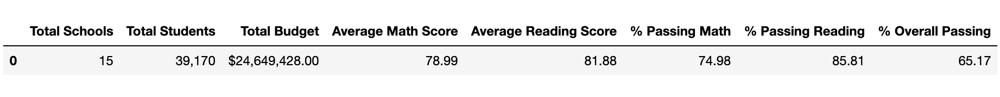
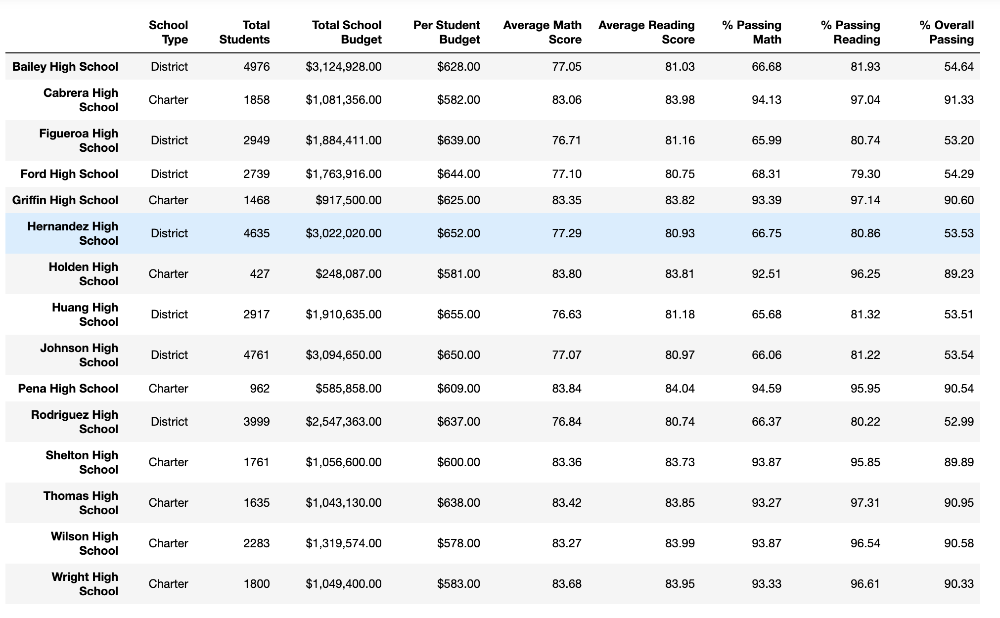
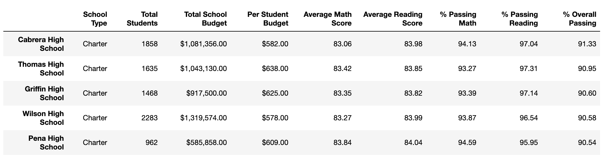
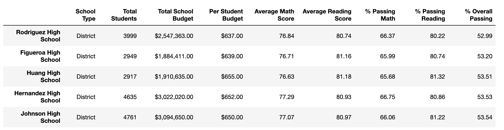
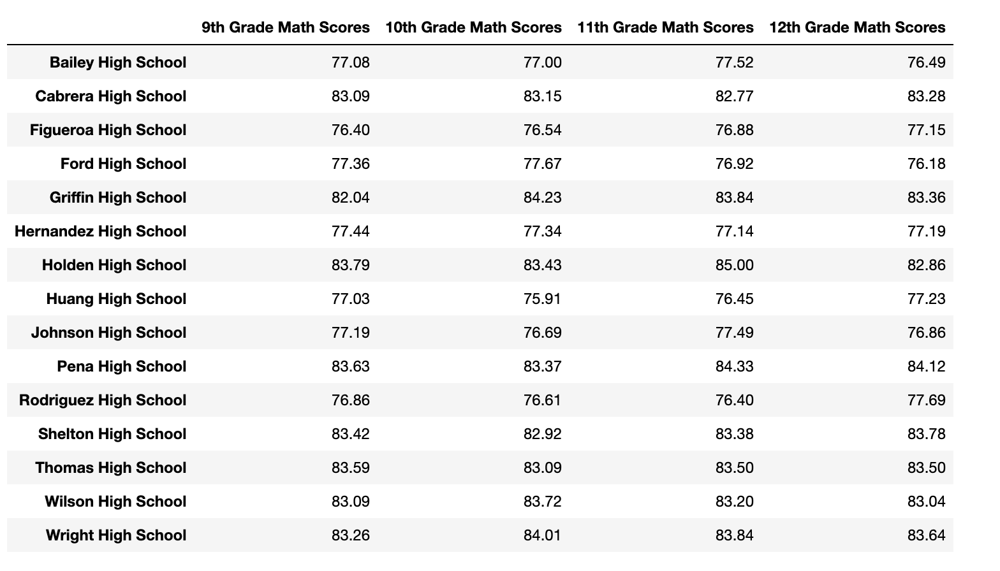
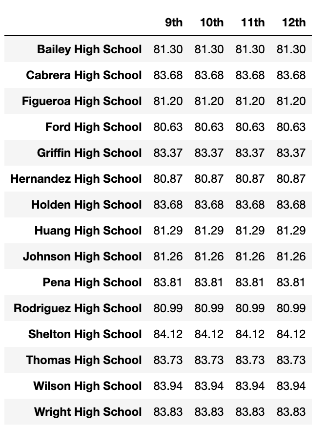

# PyCitySchools Analysis Report
******

## District Summary

As we serve close to 40,000 students across 15 different high schools, ranging in size from small (less than 1000 students) to large (2000-5000 students), we need to consider how we are measuring success in our testing regime and what schools are reaching that threshold. Once we have determined “success”, there are many factors, such as the school-type, the student funding rate per school, student performance across grade levels, along with the previously mentioned school size to consider. Before we look at those metrics though, let’s dive into the data.

## School Summary

First off, let us define success as any student receiving a 70% or higher on either of the two tests they took in this last round of testing. By this metric, our overall district averages look good, with our average math score being 78.99% and our average reading score being 81.88%. Both of these averages are comfortably above the 70% passing threshold, but a better gauge of student success, I believe, would be to look at the percentage passing either or both of the tests. Here, the story gets a little murkier.

As stand-alone figures, our percentage passing rates track with our average scores. Approximately, 75% of our students passed the math exam while an impressive 86% passed the reading exam. The problem lies when you look at how students do across both tests. Here our percentage passing rate drops to 65%. While this could speak to students being more naturally inclined to one subject matter or the other, the data reflects that our students don’t share the same level of success when you combine different disciplines. This figure should be red-flagged, and we could do an even more granular analysis to find out which schools, which students, and/or which grade levels these gaps are most prominent. Something to consider.

## Highest vs. Lowest Performing Schools

Next, let’s look at our highest performing schools vs. our lowest performing schools. The two factors that correlate most strongly to performance seem to be the school type and the size of the school, not per student spending. Every one of our five highest performing schools (each of whom have overall passing rates over 90%) are small charter schools. All of our lowest performing schools (where less than 54% of all students pass both exams) are large district schools. This disturbing thru-line could have multiple factors. It could be that the nature of charter school instruction could be reaching more students. It could be that having less students at a school could make an impact on student’s feeling seen and being held accountable. It could be that higher-achieving students are self selecting our charter high schools and creating bias in our numbers. We would need to go back into our data, and possibly even collect more, before we would have a truer sense of why this is happening. It is interesting to note though that our per student budget does not have as strong a correlation as these factors. Yet, we would also need to research further to analyze how these funds are being used at the various schools before drawing any more conclusions about how money spent per student is impacting their achievement.

## Math Performance Across Grade Levels

## Reading Performance Across Grade Levels

Lastly, when look at our students performing across grade levels, there does not appear to be much growth or regression in student success as they progress through high school. Essentially, they, as a whole, come in able to perform at a certain level comparable to the material upon which they are being assessed and leave being able to perform almost exactly at the same level even as the material becomes more challenging. 

This grade-level data does bring up interesting implications for how we measure success. If we ran a longitudinal study on a few cohorts of incoming freshman, would we find that the same kids, or relatively the same kids, are able to pass the exams as freshman running through being seniors? Who have impacted if we haven’t changed anyone’s behavior when it comes to these tests? This is not to suggest that we don’t serve an important role in preparing students to be successful, but if what we want is to change the fortunes of students in need of improving, are we really helping them when it comes to these fundamental skills if they don't improve?

